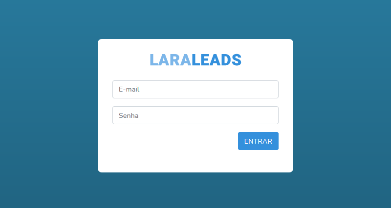
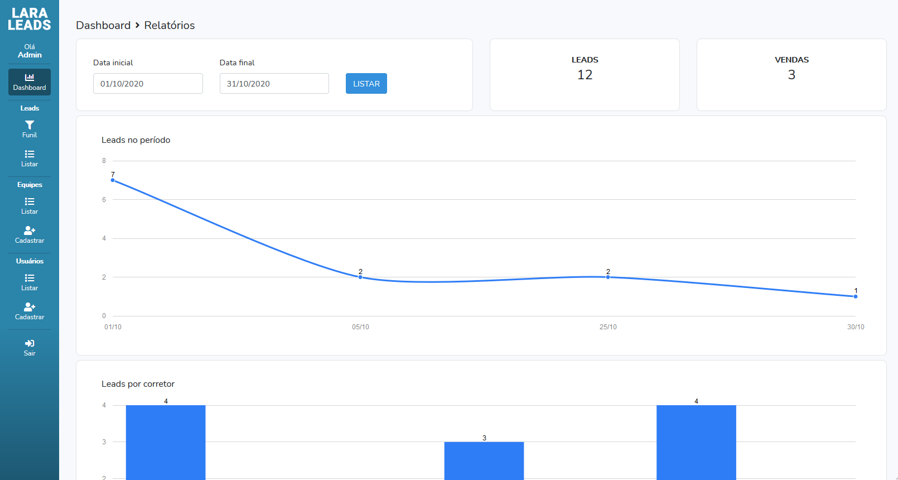
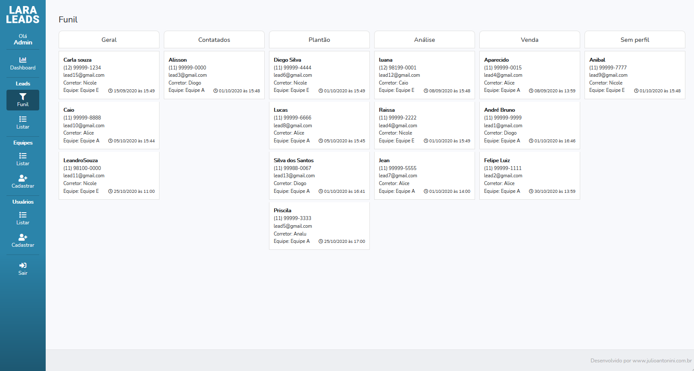
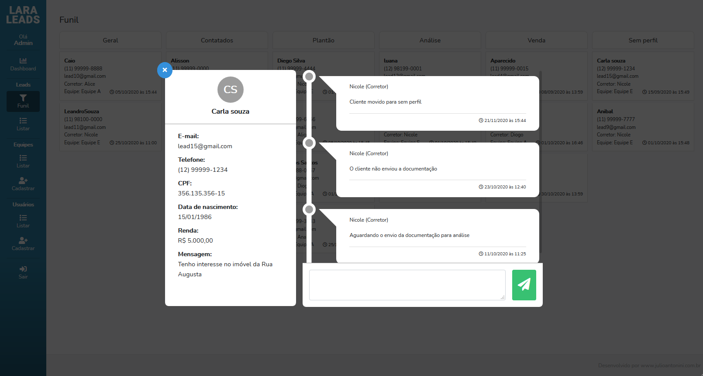
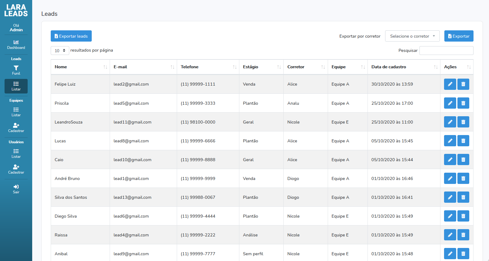
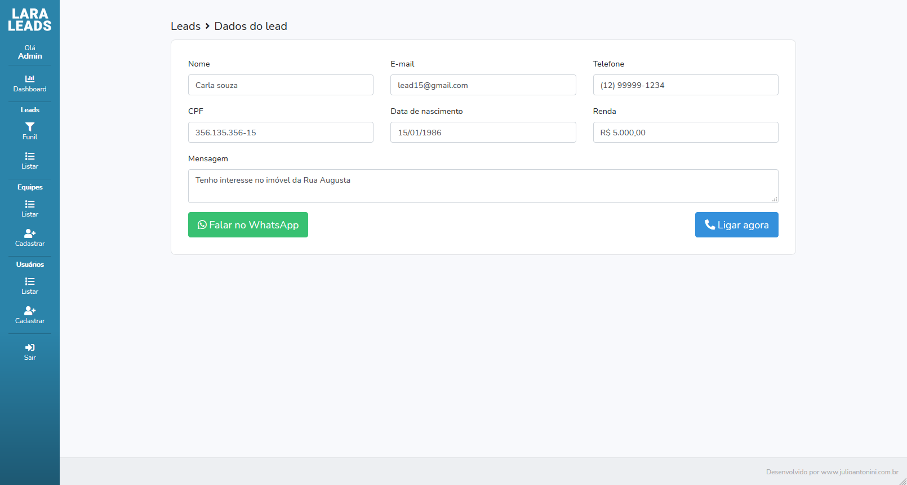
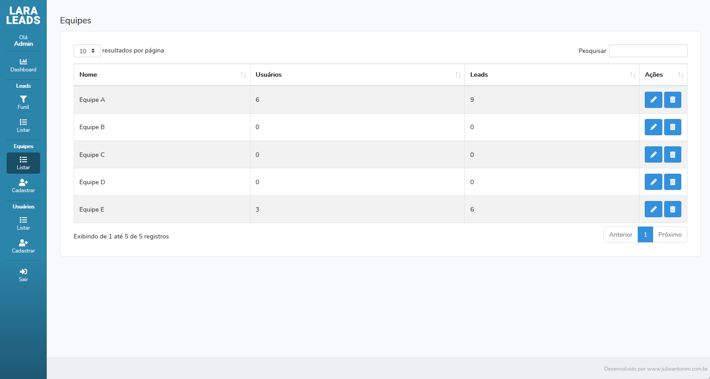
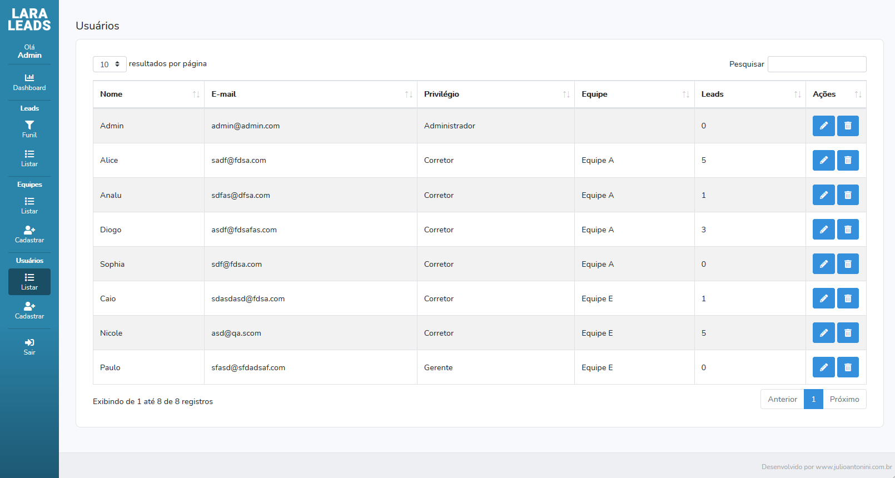

# LaraLeads
Lead receipt manager focused on real estate, but that can be customized according to your needs


## Screenshots:
<div>
   
   
   
   
   
   
   
   
</div>

## Technologies:
- Php
- Laravel
- MySQL
- Mvc pattern
- Jquery
- Jquery DataTables
- Morris js
- SweetAlert2
- Bootstrap 4
- Css 3
- Html 5

## System requirements:
- Php 7.2.5+
- MySQL 5.6+
- Composer

## Functionalities:
- Users:
3 levels, Admin, manager of team and Realtor.
- Teams:
Separate teams by manager
- Leads:
Manage incoming leads
- Roulette:
Equal division of leads between team
- Cron Job:
If enabled, if a Realtor does not see the lead within 15 minutes, the lead will be redirected to another Realtor on the team


## Installation:
After cloning this repository, create the .env file based on the env.example file in the root directory and fill in the requested data according to your server, then execute the commands below  in your command line interface:


```bash
# Install the dependencies
composer install --optimize-autoloader --no-dev 
# Generate the app key
php artisan key:generate
# Run the Migrations
php artisan migrate
# Run the seeds
php artisan db:seed
```

## Configuring cron:
Add the line below to your server's task scheduler every 15 minutes.


```bash
curl --silent https://www.yoursite.com/cron
```
###### The laravel task scheduler was not used in this project to  facilitate operation on shared servers (cpanel)

## Receiving leads:
Submit a post request to the url below:
```bash
https://www.yoursite.com/insert-lead
```
With the following fields:
```bash
# Lead information
name
email
phone
comments
cpf
birthdate
income
# Return url
redirect_url
```


## Administration:
```bash
# Administration url
https://www.yoursite.com/admin

# Administration default user
E-mail: admin@admin.com
Password: 12312312
```

### Live demo:  
https://www.projetos.top/projetos/laraleads/

#### Project date:  
October 2020

